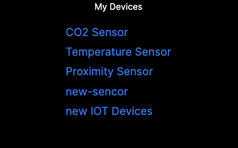
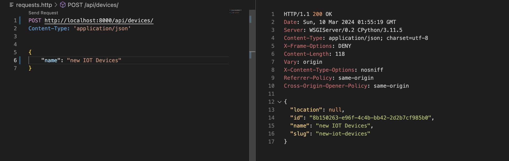

# Developing modern APIs with Django

Django API  

React APP  

## Project Overview

This project aims to demystify the process of developing modern APIs using Django and integrating them with a React/Next.js frontend. It focuses on creating and managing IoT devices and their assignments to specific locations through a clean, user-friendly interface.

## Django Ninja Overview

Django Ninja is used for its efficient API development capabilities, focusing on:

- **Schemas (Schemas.py):** Define data processing rules for both input (POST requests) and output (GET requests).
- **API Endpoints/Routes (app.py):** Configure the API's endpoints to interact with the data.

## Setup

- Copy repo from github
- install requirements.txt and react/Next.js
- runservers on localhost 8000 and 3000 for django and react respectively

## API Endpoints
The following endpoints are available:

- GET api/devices/: Retrieve a list of all devices.
- GET api/locations/: Retrieve a list of all locations.
- GET api/devices/{slug}/: Retrieve one device.
- POST api/devices/: Create new device.
- POST devices/{device_slug}/set-location/: Set the location of a device.

## Example

POST api/devices/: Create new device.

## Credit

following another amazing tutorial by Bugbytes:
https://www.youtube.com/watch?v=XqkqbsdtoMI&t=1555s